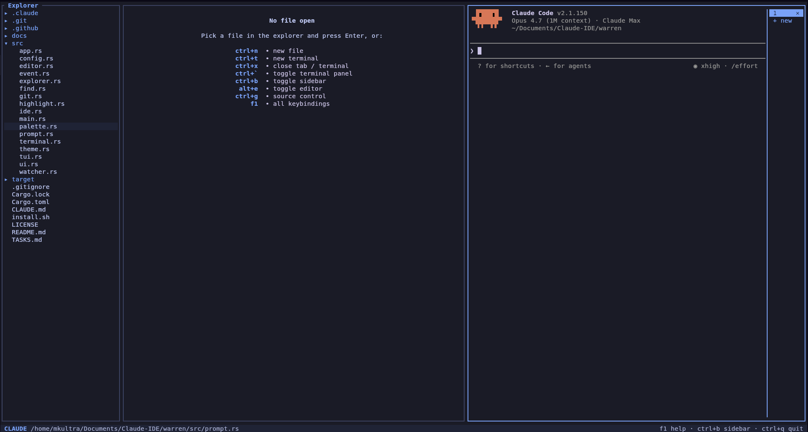

# warren

A terminal IDE that **wraps the real [Claude Code](https://claude.com/claude-code) CLI** — not a
reimplemented agent. File explorer, a lightweight editor with tabs and syntax highlighting, an
embedded `claude` pane, multiple terminals, git, and **live accept/reject diffs** for the edits
Claude proposes — all in one terminal, so you never leave it to juggle separate windows.



Built with Rust + [ratatui](https://ratatui.rs). Runs on Linux and macOS.

## Install

```sh
curl -fsSL https://raw.githubusercontent.com/Yok4ai/warren/master/install.sh | sh
```

Downloads the prebuilt binary for your OS/architecture (Linux x86_64/arm64, macOS Intel/Apple
Silicon) and installs it to `~/.local/bin`. Override the location with `WARREN_INSTALL_DIR`, or pin
a version with `WARREN_VERSION=v0.1.0`.

<details>
<summary>From source (needs Rust ≥ 1.85)</summary>

```sh
git clone https://github.com/Yok4ai/warren
cd warren
cargo install --path .
```
</details>

> The embedded Claude pane and the diff integration need the real `claude` CLI on your `PATH`.
> Everything else (editor, explorer, terminals, git) works without it.

## Usage

```sh
warren            # open the current directory
warren /path/dir  # open a specific folder
```

Open a terminal (`ctrl+t`) and run `claude` in it. When Claude proposes an edit, warren shows it as
a full-file inline diff with real line numbers — press `enter` to accept or `esc` to reject.

## Features

- **Wraps the real `claude`** in a PTY pane — full color, mouse, and input fidelity.
- **Live diffs** — Claude's edits open as a VS Code-style whole-file diff (dual old│new line
  numbers, green/red, jumps to the first change); accept/reject without leaving warren.
- **Editor** — tabs, syntax highlighting, rope buffers, undo/redo, find, text selection, save,
  auto-save.
- **File explorer** — lazy tree, fs-watch refresh, click/keyboard nav; follows the active tab.
- **Multiple terminals** — vertical tab strip, 5000-line scrollback, drag-to-select + copy.
- **Git** — status, staging, commit, file diffs, and a commit graph in the source-control view.
- **Command palette** (`ctrl+p`) — fuzzy file finder + commands.
- **Themes** — Tokyo Night/Glow, Catppuccin, Dracula, Gruvbox, Light; optional solid background.

## Keybindings

| Key | Action |
|---|---|
| `ctrl+q` | quit |
| `ctrl+p` | command palette / fuzzy finder |
| `f1` | keybindings overlay |
| **Panes** | |
| `ctrl+b` | toggle sidebar |
| `alt+e` | toggle editor |
| `ctrl+g` | source control |
| `ctrl+w` | cycle focus between panes |
| `ctrl+t` | new terminal |
| `` ctrl+` `` | toggle terminal panel |
| **Files & tabs** | |
| `ctrl+n` | new file |
| `ctrl+s` | save |
| `ctrl+x` | close tab |
| `ctrl+pageup` / `ctrl+pagedown` | previous / next tab |
| **Editing** | |
| `ctrl+z` / `ctrl+y` | undo / redo |
| `ctrl+c` / `ctrl+v` | copy / paste |
| `ctrl+a` | select all |
| `ctrl+f` | find |
| **Toggles** | |
| `alt+s` | toggle scrollbars |
| `alt+a` | toggle auto-save |

In a terminal pane: mouse-drag or `pageup`/`pagedown` scrolls the scrollback; drag selects text
(copied on release); typing snaps back to live output.

## Configuration

warren reads `~/.config/warren/config.toml` for keybindings and `[settings]` defaults. Runtime UI
choices (theme, solid background) persist to `~/.config/warren/state.toml`. Both are optional —
warren ships sensible defaults.

## How the Claude diff integration works

warren implements the same WebSocket MCP protocol that Claude Code's editor extensions use. On
startup it writes a lockfile to `~/.claude/ide/<port>.lock` and points any `claude` launched in its
terminals at that port. When Claude calls `openDiff`, warren renders the proposed change in the
editor and reports your accept/reject back over the protocol. See
[`docs/ide-integration.md`](docs/ide-integration.md).

## Building

```sh
cargo build --release   # optimized build
cargo clippy            # lint (kept warning-free)
cargo run --release     # run in the current directory
```

Tagging a `v*` release on GitHub triggers CI to build and attach the binaries that `install.sh`
downloads.

## License

[MIT](LICENSE)
